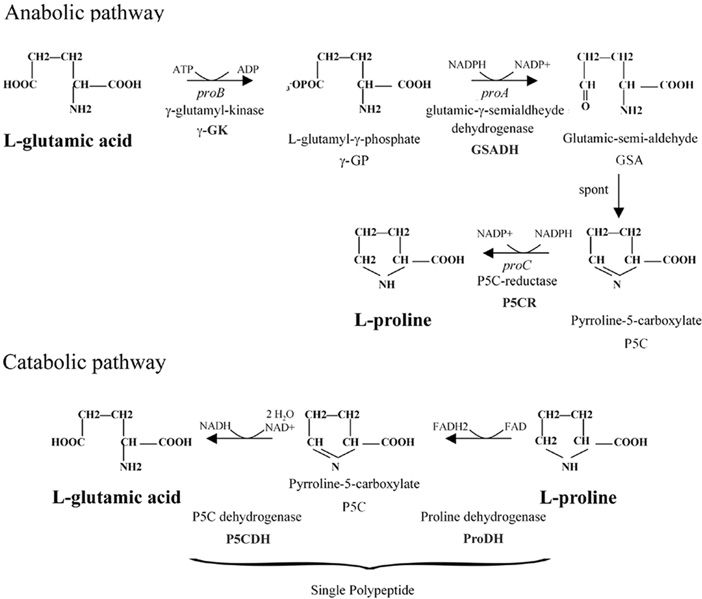

# About {.unnumbered}

**The living book of Marshall** was born from the idea of producing content based on the concept of open science. It is important to be clear that this book is not peer-reviewed. At least not in the traditional way. The content of this book includes a series of notes on topics of interest to me. Topics that I have been working on in my day-to-day life as a researcher in the areas of biomaterials, bioinformatics, data science, and bone regeneration biology.\
As you read this book you will probably come across some incomplete section. Don't worry, this is part of the idea of a living book. This book will never have a final version. I will try to add sections as I go deeper and believe it is important to share them with the community.\
If you find any wrong information feel free to contact me through my [github profile](https://github.com/marceelrf#-ask-me-anything).

## About me


I'm a brazilian medical physicist with master in Biotechnology and currently a PhD candidate (Biotechnology) at São Paulo State University ([UNESP](https://unesp.br/)). On April 2022 I joined the Witek Lab at [New York University](https://www.nyu.edu/) as a visiting schoolar. I'm currently working on the development of tools for bone biomaterials analysis, focusing on alternative methods to animal testing. I have interest in biological databases, bioinfomatics analysis, data science, machine learning and new technologies as 3D bioprinting and organ-on-a-chip. I am an enthusiast of open science and the R programming language. Right now I am preparing the documentation for my first package!\
For my scientific publication records please check my [google schoolar profile](https://scholar.google.com.br/citations?user=lS42GYwAAAAJ&hl=pt-BR)


<!--chapter:end:index.Rmd-->

# Hello bookdown 

All chapters start with a first-level heading followed by your chapter title, like the line above. There should be only one first-level heading (`#`) per .Rmd file.

## A section

All chapter sections start with a second-level (`##`) or higher heading followed by your section title, like the sections above and below here. You can have as many as you want within a chapter.

### An unnumbered section {-}

Chapters and sections are numbered by default. To un-number a heading, add a `{.unnumbered}` or the shorter `{-}` at the end of the heading, like in this section.

<!--chapter:end:01-intro.Rmd-->

# (PART\*) R programming {.unnumbered}

# R basics {#rprog}

The R language was developed for data analysis with a solid statistical background. R is a multi-paradigm object-oriented, functional programming, dynamic, weakly typed, programming language focused on data manipulation, analysis, and visualization. It was originally created by Ross Ihaka and Robert Gentleman in the Statistics department at the University of Auckland, New Zealand. The Base R packages are developed and maintained by the R Development Core Team (R Core), through their controlled Software Development Life Cycle (SDLC). All source code is available for review under the Free Software Foundation's GNU Public License (GPL). You can download in the Comprehensive R Archive Network ([CRAN](https://cran.r-project.org/)) website.

There are several development interfaces for programming with R, but among all of them I strongly recommend using [RStudio](https://www.rstudio.com/). You can work with in Windows, Mac, and Linux, or through a web browser using the RStudio server, if you want.

[!RSTUDIO(https://en.wikipedia.org/wiki/RStudio#/media/File:RStudio_IDE_screenshot.png)](https://en.wikipedia.org/wiki/RStudio#/media/File:RStudio_IDE_screenshot.png)

## R object classes  

<!--chapter:end:02-Rbasics.Rmd-->

# Parts

You can add parts to organize one or more book chapters together. Parts can be inserted at the top of an .Rmd file, before the first-level chapter heading in that same file. 

Add a numbered part: `# (PART) Act one {-}` (followed by `# A chapter`)

Add an unnumbered part: `# (PART\*) Act one {-}` (followed by `# A chapter`)

Add an appendix as a special kind of un-numbered part: `# (APPENDIX) Other stuff {-}` (followed by `# A chapter`). Chapters in an appendix are prepended with letters instead of numbers.


<!--chapter:end:03-parts.Rmd-->

# Footnotes and citations 

## Footnotes

Footnotes are put inside the square brackets after a caret `^[]`. Like this one ^[This is a footnote.]. 

## Citations

Reference items in your bibliography file(s) using `@key`.

For example, we are using the **bookdown** package [@R-bookdown] (check out the last code chunk in index.Rmd to see how this citation key was added) in this sample book, which was built on top of R Markdown and **knitr** [@xie2015] (this citation was added manually in an external file book.bib). 
Note that the `.bib` files need to be listed in the index.Rmd with the YAML `bibliography` key.


The `bs4_book` theme makes footnotes appear inline when you click on them. In this example book, we added `csl: chicago-fullnote-bibliography.csl` to the `index.Rmd` YAML, and include the `.csl` file. To download a new style, we recommend: https://www.zotero.org/styles/


The RStudio Visual Markdown Editor can also make it easier to insert citations: <https://rstudio.github.io/visual-markdown-editing/#/citations>

<!--chapter:end:04-citations.Rmd-->

# Blocks

## Equations

Here is an equation.

\begin{equation} 
  f\left(k\right) = \binom{n}{k} p^k\left(1-p\right)^{n-k}
  (\#eq:binom)
\end{equation} 

You may refer to using `\@ref(eq:binom)`, like see Equation \@ref(eq:binom).


## Theorems and proofs

Labeled theorems can be referenced in text using `\@ref(thm:tri)`, for example, check out this smart theorem \@ref(thm:tri).

::: {.theorem #tri}
For a right triangle, if $c$ denotes the *length* of the hypotenuse
and $a$ and $b$ denote the lengths of the **other** two sides, we have
$$a^2 + b^2 = c^2$$
:::

Read more here <https://bookdown.org/yihui/bookdown/markdown-extensions-by-bookdown.html>.

## Callout blocks


The `bs4_book` theme also includes special callout blocks, like this `.rmdnote`.

::: {.rmdnote}
You can use **markdown** inside a block.


```r
head(beaver1, n = 5)
#>   day time  temp activ
#> 1 346  840 36.33     0
#> 2 346  850 36.34     0
#> 3 346  900 36.35     0
#> 4 346  910 36.42     0
#> 5 346  920 36.55     0
```

:::

It is up to the user to define the appearance of these blocks for LaTeX output. 

You may also use: `.rmdcaution`, `.rmdimportant`, `.rmdtip`, or `.rmdwarning` as the block name.


The R Markdown Cookbook provides more help on how to use custom blocks to design your own callouts: https://bookdown.org/yihui/rmarkdown-cookbook/custom-blocks.html

<!--chapter:end:05-blocks.Rmd-->

# Sharing your book

## Publishing

HTML books can be published online, see: https://bookdown.org/yihui/bookdown/publishing.html

## 404 pages

By default, users will be directed to a 404 page if they try to access a webpage that cannot be found. If you'd like to customize your 404 page instead of using the default, you may add either a `_404.Rmd` or `_404.md` file to your project root and use code and/or Markdown syntax.

## Metadata for sharing

Bookdown HTML books will provide HTML metadata for social sharing on platforms like Twitter, Facebook, and LinkedIn, using information you provide in the `index.Rmd` YAML. To setup, set the `url` for your book and the path to your `cover-image` file. Your book's `title` and `description` are also used.


This `bs4_book` provides enhanced metadata for social sharing, so that each chapter shared will have a unique description, auto-generated based on the content.

Specify your book's source repository on GitHub as the `repo` in the `_output.yml` file, which allows users to view each chapter's source file or suggest an edit. Read more about the features of this output format here:

https://pkgs.rstudio.com/bookdown/reference/bs4_book.html

Or use:


```r
?bookdown::bs4_book
```


<!--chapter:end:06-share.Rmd-->

# (PART\*) Bone biology {-}
# Proline Metabolism

This chapter is inspired in the Dr Karner's Lab (<https://www.utsouthwestern.edu/labs/karner/research/proline.html>)

## General metabolism

Proline is biosynthetically derived from the amino acid L-glutamate. Glutamate-5-semialdehyde is first formed by glutamate 5-kinase (ATP-dependent) and glutamate-5-semialdehyde dehydrogenase (which requires NADH or NADPH).

[](https://www.researchgate.net/profile/Maurizio-Trovato/publication/226456939/figure/fig1/AS:393621418332161@1470858067068/Pathway-of-proline-biosynthesis-and-degradation-in-bacteria.png)

## How is proline uptake regulated during osteoblast differentiation?

Slc38a2 (Sodium-coupled neutral amino acid transporter 2)

## What are the proline transporters and how are they regulated?

<!--chapter:end:07-Proline-Metabolism.Rmd-->


# References {-}


<!--chapter:end:08-references.Rmd-->

# Cross-references {#cross}

Cross-references make it easier for your readers to find and link to elements in your book.

## Chapters and sub-chapters

There are two steps to cross-reference any heading:

1. Label the heading: `# Hello world {#nice-label}`. 
    - Leave the label off if you like the automated heading generated based on your heading title: for example, `# Hello world` = `# Hello world {#hello-world}`.
    - To label an un-numbered heading, use: `# Hello world {-#nice-label}` or `{# Hello world .unnumbered}`.

1. Next, reference the labeled heading anywhere in the text using `\@ref(nice-label)`; for example, please see Chapter \@ref(cross). 
    - If you prefer text as the link instead of a numbered reference use: [any text you want can go here](#cross).

## Captioned figures and tables

Figures and tables *with captions* can also be cross-referenced from elsewhere in your book using `\@ref(fig:chunk-label)` and `\@ref(tab:chunk-label)`, respectively.

See Figure \@ref(fig:nice-fig).


```r
par(mar = c(4, 4, .1, .1))
plot(pressure, type = 'b', pch = 19)
```

<div class="figure" style="text-align: center">

<p class="caption">(\#fig:nice-fig)Here is a nice figure!</p>
</div>

Don't miss Table \@ref(tab:nice-tab).


```r
knitr::kable(
  head(pressure, 10), caption = 'Here is a nice table!',
  booktabs = TRUE
)
```


Table: (\#tab:nice-tab)Here is a nice table!

| temperature| pressure|
|-----------:|--------:|
|           0|   0.0002|
|          20|   0.0012|
|          40|   0.0060|
|          60|   0.0300|
|          80|   0.0900|
|         100|   0.2700|
|         120|   0.7500|
|         140|   1.8500|
|         160|   4.2000|
|         180|   8.8000|

<!--chapter:end:cross-refs.Rmd-->

