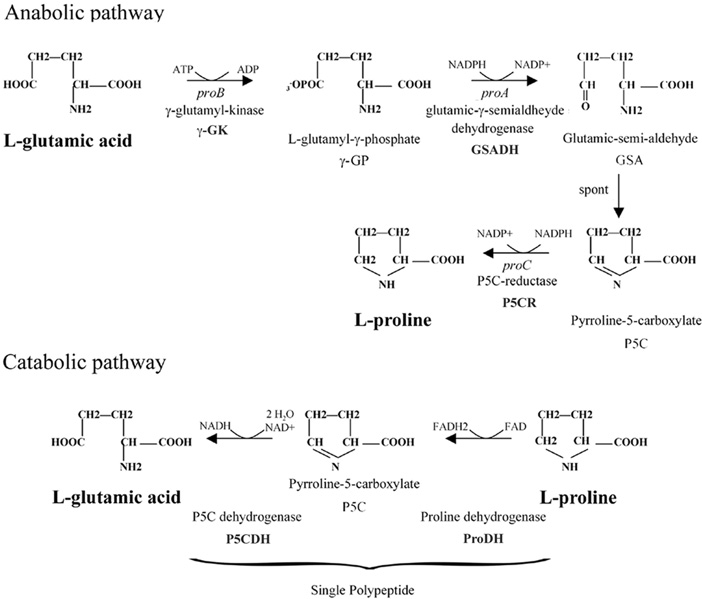

# Proline Metabolism

This chapter is inspired in the Dr Karner's Lab (<https://www.utsouthwestern.edu/labs/karner/research/proline.html>)

## General metabolism

Proline is biosynthetically derived from the amino acid L-glutamate. Glutamate-5-semialdehyde is first formed by glutamate 5-kinase (ATP-dependent) and glutamate-5-semialdehyde dehydrogenase (which requires NADH or NADPH).

## How is proline uptake regulated during osteoblast differentiation?

Slc38a2 (Sodium-coupled neutral amino acid transporter 2)

## What are the proline transporters and how are they regulated?
